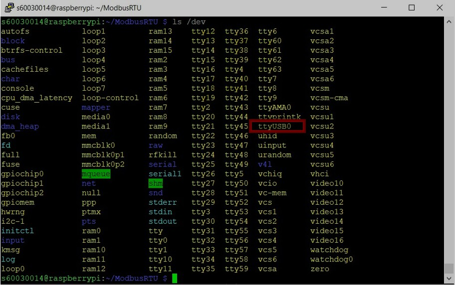

# ModbusRTU
 
## Basic

### Sensor : XY-MD02 


### การต่อใช้งาน


### DataSheet


### การใช้งาน

- ใช้ Command Register 0x04 Read input register 

- Input Register ใช้ในการอ่านค่า Temperature และ Humindity 

    - ซึ่งตำแหน่งของ Temperature จะเป็น 0x0001 
    - ตำแหน่งของ Humidity จะเป็น 0x0002

### Modbus serial
 

#### Install 

```js
    npm install modbus-serial --save 
``` 

[Method](https://github.com/yaacov/node-modbus-serial/wiki/Methods)

.writeRegister (address, value)
    
```js
    Writes "Preset Single Register" (FC=4) request to serial port.
```
address {number}: The Data Address of the first register.
value {number}: The value to set into the register.

#### การใช้งาน
- ใช้ (FC=4) คือ Command Register 0x04 ที่ใช้ในการอ่าน input register 
- ซึ่งจะรับ parameter address และ length ซึ่งระบุ address จาก 1 ไป 2 ที่มีค่า length เป็น 2

## การเชื่อมต่อ Raspberry pi 
- เชื่อมต่อ Sensoe XY-MD02 เข้าสู่ Rasberry Pi ผ่าน RS485 Module 

    

    

### สแกนหา module RS485 
- เปิดหน้าต่าง Terminal 

    - ใช้คำสั่ง 

        ```js
            $ ls /dev
        ```
- ถ้าหากสแกนหาเจอ จะขึ้นตัวอย่างดังรูปดังนี้ 

    
    ในวงสีแดง จะเห็นว่ามี ttyUSB0 เพิ่มขึ้นมา
    
## Modbus 

### Express

- setting web request

    ```js
    var express=require('express');
    var morgan=require('morgan');
    var compression=require('compression');
    var bodyParser=require('body-parser');

    module.exports=()=>{
    var app=express();
    app.use(morgan('dev'));
    app.use(bodyParser.urlencoded({
	extended: true
    }));
    app.use(express.static('./public'));
    app.use(bodyParser.json());
    app.set('views','./app/views');
    app.set('view engine', 'jade');
    require('../app/routes/index.route')(app);
    require('../app/routes/api.route')(app);
    return app;
    }
    ```

### การอ่านค่า

- ประกาศค่าเริ่มต้น

    ```js
    var ModbusRTU=require('modbus-serial');
    var client=new ModbusRTU();
    client.connectRTU("/dev/ttyUSB0",{buadRate:9600}); 

    ```
    โดย /dev/ttyUSB0 คือพอร์ต ของ RS485

 - ทดลองอ่านค่า โดยใช้คำสั่ง

    ```js
    client.readInputRegisters(1,2).then((data)=>{
    console.log(data);
    }).catch((e)=>{
    console.log(e.message);
    });
    ```
- บันทึกค่าไว้ใน Database และประกาศค่า readInputRegisters และ ให้ทำการอัพเดตทุกๆ 60000 m/s หรือ 1 นาที

    ```js
    setInterval(()=>{
    modbusRTU.readInputRegisters(1,2)
    .then((data)=>{
        var allData=data.data;
        var model={
            temperature: allData[0]/10,
            humidity: allData[1]/10,
            datetime: Date.now()
        }
        modbusModel.insertMany(model,(err,docs)=>{
            if(err)console.log(err);
        });
    }).catch((e)=>{
        console.log(e.message);
    })
    },60000); 
    ```

- ประกาศค่าเริ่มต้น เก็บค่า อุณหภูมิ ความชื้น และวันเวลา
    ```js
    var modbusSchema=new Schema({ temperature: Number, humidity: Number, datetime: String });
    ```
### Api Controller 

- เป็นฟังก์ชั่นการทำงานที่จะรีเทิร์นค่ากลับ
    
    ```js
    var modbus=(req,res)=>{
    modbusModel.find({},(err,data)=>{
        if(!err){
            let detail=new Array();
            let tmp={};
	        data.sort((a,b)=>{
		        return b.datetime-a.datetime;
	        });
            data.forEach((item,index)=>{
		        if(!item.temperature||!item.humidity||item.humidity>100||item.temperature>100)return;
                let dt=new Date(parseInt(item.datetime));
                detail.push({'dateTime':dt, 'temperature':item.temperature, 'humidity':item.humidity});
            });
            detail.forEach((item,index)=>{
                if(isNaN(item.dateTime.getUTCDate())||isNaN(item.dateTime.getUTCMonth())||isNaN(item.dateTime.getUTCFullYear())||!item.temperature||!item.humidity)return;
		        let obj=tmp[item.dateTime.getUTCDate()+'/'+(item.dateTime.getUTCMonth()+1)+'/'+item.dateTime.getUTCFullYear()]=tmp[item.dateTime.getUTCDate()+'/'+(item.dateTime.getUTCMonth()+1)+'/'+item.dateTime.getUTCFullYear()]||{count:0, totalTemperature:0, totalHumidity:0};
		        obj.count++;
		        obj.totalTemperature+=item.temperature;
		        obj.totalHumidity+=(item.humidity/5);
            });
	        let result=Object.entries(tmp).map(function(entry){
		        return {date: entry[0], temperature: entry[1].totalTemperature/entry[1].count, humidity: entry[1].totalHumidity/entry[1].count};
	        });
            res.json({detail:detail, average: result.slice(0,7)});
        }
    })
    }
    ```
### การดึงข้อมูล

- ประกาศค่าการดึงข้อมูลมาแสดงในหน้า index

    ```js
    var render=(req,res)=>{
    modbusModel.find({},(err,data)=>{
	    if(!err)res.render('index',{tempData: data});
    });
    }
    ```

- ดึงข้อมูลจาก Databsae โดยใช้ mongoose
    
    ```js
    var mongoose=require('mongoose');

    module.exports=()=>{
    mongoose.set('debug',true);
    var db=mongoose.connect('mongodb://localhost/modbus');
    require('../app/models/modbus.model');
    return db;
    }
    ```
- แสดงผลโดยใช้ jade
    
    ```js
    doctype html
    html(lang="en")
    head
        meta(charset='utf-8')
        meta(name='viewport', content='width=device-width, initial-scale=1.0')
        link(rel="stylesheet", href="/lib/angular-datatables/dist/css/angular-datatables.min.css")
        link(rel="stylesheet", href="/lib/datatables.net-dt/css/jquery.dataTables.min.css")
    body(ng-app='app')
        h1(style='text-align: center; color: blue;') Temperature and Humidity Monitoring.
        div(ng-controller='LineCtrl')
            canvas(class="chart chart-line" chart-data="data" chart-labels="labels" chart-series="series" chart-options="options" chart-click="onClick")
        div(ng-controller='DatatablesCtrl')
            //- p {{ details }}
            table(datatable="ng" dt-options="dtOptions" dt-column-defs="dtColumnDefs" dt-instance="dtInstance" class="table table-striped table-bordered")
                thead
                    tr
                        th #
                        th Temperature
                        th Humidity
                        th Datetime
                tbody
                    tr(ng-repeat="detail in details")
                        th {{ $index+1 }}
                        th {{ detail.temperature }}
                        th {{ detail.humidity }}
                        th {{ detail.dateTime | formatAsDate }}
    script(src="/lib/jquery/dist/jquery.min.js")
    script(src="/lib/datatables.net/js/jquery.dataTables.min.js")
    script(src="/lib/chart.js/dist/Chart.min.js")
    script(type='text/javascript', src='/lib/angular/angular.min.js')
    script(src="/lib/ang
    ular-datatables/dist/angular-datatables.min.js")
    script(src="/lib/angular-chart.js/angular-chart.js")
    script(src="/lib/moment/min/moment.min.js")
    script(type='text/javascript', src='/tempChart.js')
    ```


